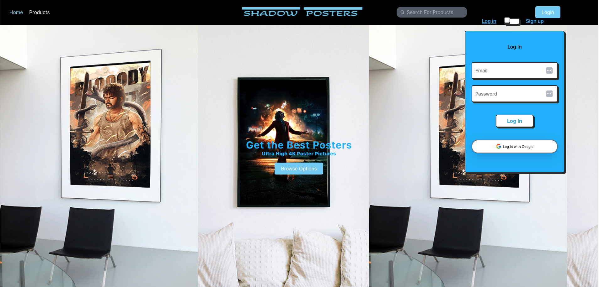
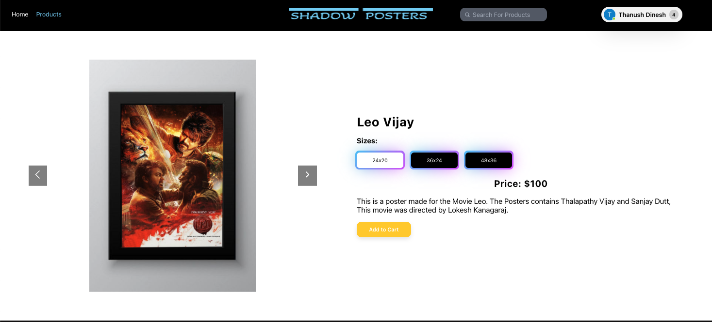
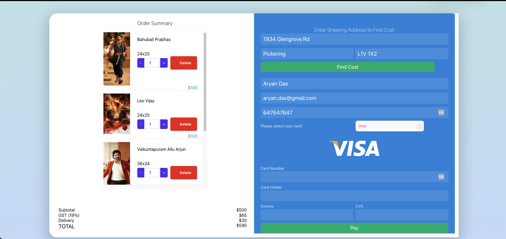

# Ecommerce App

This project is an ecommerce web application built with React for the frontend and .NET for the backend.

## Features
- Product Catalog: Browse and search for products.
- User Authentication: Register, login, and manage user accounts.
- Shopping Cart: Add products to cart and manage cart items.
- Checkout Process: Proceed to checkout and place orders.
- Payment Handling: Pay for orders using Stripe.
- Admin Dashboard: Manage products, orders, and users (admin features).

## Technologies Used
- Frontend: 
  - React 
  - Redux (for state management)
  - React Router (for navigation)
  - Axios (for HTTP requests)
  - Tailwind CSS (for styling)

- Backend: 
  - .NET Core
  - Entity Framework Core (ORM)
  - ASP.NET Core Identity (for authentication)
  - Swagger (API documentation)
  - Stripe (for payment processing)
  - MailKit (for sending emails)

## Installation
1. Clone the repository: `git clone https://github.com/Thanush38/ECommerce.git`
2. Change directory: `cd ECommerce`
3. Start the backend server: `cd server && dotnet run`
4. Start the frontend server: `cd client && npm start`
5. Open the browser and go to `http://localhost:3000`

## Screenshots

## Contributing
Contributions are welcome! If you find any bugs or want to improve the project, feel free to open an issue or submit a pull request.
## License
This project is open source and available under the [MIT License](LICENSE.md).

